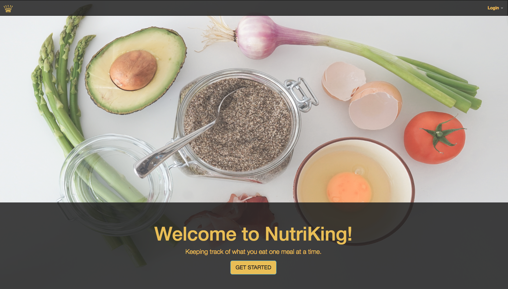
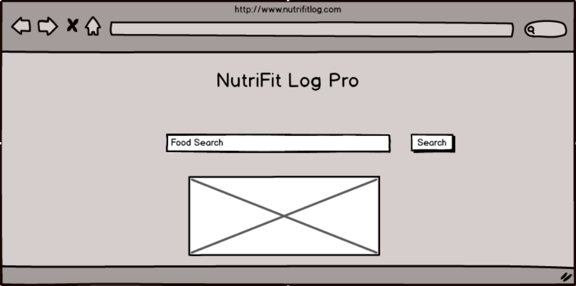
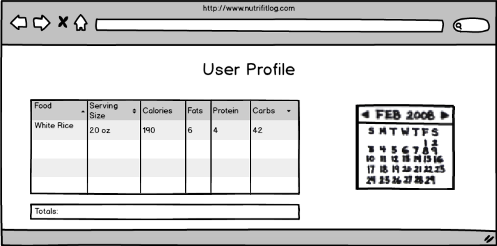

# WDI Project 3: NutriKing

NutriKing was created by Lawrence Gomez, Shahrooz Hedayati and Hines Kao as their third project for General Assembly's WDI course in Santa Monica.

### Objective

NutriKing is a health oriented site where the user can log and track their meals during the day to see how many calories they've consumed.

### Installation

No installation required, click [here](https://mighty-inlet-45127.herokuapp.com/) to acccess the site and get started!

### Project Requirements

The guidelines listed below were provided by the project markdown:

* User of MongoDB and Express to create data CRUD
* Produce a RESTful API that expresses at least one model
* Consume its own API using AJAX
* Authenticate users using at least one OAuth provider
* Restrict access to the Creation, Updating, and Deletion of resources using an authorization middleware function
* Be deployed online using Heroku

Necessary Deliverables

* A pitch deck, delivered as a team to the instructors
* A working app, built by the whole team, hosted somewhere on the Internet
* A client application that consumes our own API, hosted somewhere on the internet
* A link to our hosted, working app in the URL section of our Github repo
* A Git repository hosted on Github, with frequent commits from every team member dating back to the very beginning of the project

### MVP

* A working login page that includes both local and OAuth login options
* A working create account feature that allows users to create a NutriKing account
* The ability for users to create, edit, and delete a profile

### Technologies/Frameworks used

* HTML5
* CSS
* Javascript
* jQuery
* AJAX
* Node.js
* Express.js
* MongoDB.js

### Approach taken

### Future Implementations

